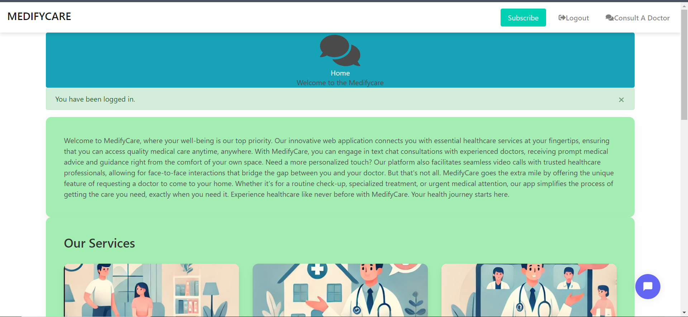

# MedifyCare

## Introduction

**MedifyCare** is a healthcare platform designed to connect patients with doctors for direct consultation, AI-powered responses for common FAQs about the platform, and request video calls with healthcare professionals. The platform provides a seamless experience for both doctors and patients, fostering real-time communication and easy access to medical expertise.

- [Deployed Site](https://medifycare.onrender.com) 
- [Final Project Blog Article](https://medium.com/@wokoisaiah68/building-medifycare-a-journey-of-bringing-doctors-and-patients-closer-ce7998033168) 
- [Author LinkedIn](http://www.linkedin.com/in/isaiah-woko-513426256)

## Installation

To install and run this project locally:

1. Clone the repository:
   ```bash
   git clone https://github.com/Isaiah-woko/medifycare.git
   ```

2. Navigate to the project directory:
   ```bash
   cd medifycare
   ```

3. Create and activate a virtual environment:
   ```bash
   python3 -m venv venv
   source venv/bin/activate 
   ```

4. Install the required dependencies:
   ```bash
   pip install -r requirements.txt
   ```


6. Run the Flask application:
   ```bash
   ./init.sh
   ```

7. Access the application locally at [http://127.0.0.1:5000](http://127.0.0.1:5000).

## Usage

Once the platform is up and running, users can:

- **Register or Log in**: Both patients and doctors can register or log in to access their respective dashboards.
- **Reset password feature: Both doctors and patients can reset there password using there email to git reset link.
- **Consult a Doctor**: Patients can engage in real-time chat with doctors.
- **AI-Powered FAQs**: Patients can get instant feedback about common queries related to the platform.
- **Request a Video Call**: Patients can request a video consultation with doctors.

## Contributing

We welcome contributions to MedifyCare. To contribute:

1. Fork the repository.
2. Create a new branch:
   ```bash
   git checkout -b feature-branch
   ```
3. Make your changes and commit them:
   ```bash
   git commit -m "Your descriptive message"
   ```
4. Push to the branch:
   ```bash
   git push origin feature-branch
   ```
5. Create a pull request.

## Related Projects

If you're interested in similar projects, check out:

- [Healthcare App]
- [Telemedicine Platform]

## Licensing

This project is licensed under the MIT License. See the [LICENSE](LICENSE) file for more details.

## Screenshot



## Test plan

### 1. Authentication: Login / Registration
- Test Setup

    Mock Database: Use a library like pytest-mock, unittest.mock, or factory_boy to create a mock database or mock ORM models (e.g., SQLAlchemy models).
    Preconditions:
        Create a mock database with user data for login tests.
        Ensure the registration process interacts with the mock database.

- Test Cases

    Login: Test a Pre-registered User
        Precondition: Mock a user with a known email and password in the database.
        Steps:
            Send a POST request to the login endpoint with valid credentials.
            Send a POST request to the login endpoint with invalid credentials.
        Expected Results:
            Valid credentials return a success response (e.g., 200 or 302 status).
            Invalid credentials return an error response (e.g., 401 Unauthorized or 400 Bad Request).

    Register: Test by Registering a New User
        Precondition: Mock the database to accept new user data.
        Steps:
            Send a POST request to the registration endpoint with new user details.
            Check if the mock database now contains the new user.
            Attempt to register the same user again.
        Expected Results:
            The first registration should return a success response (e.g., 201 Created).
            Duplicate registration attempts return an error (e.g., 400 Bad Request).

### 2. Chat Functionality
- Test Setup

    Mock Database:
        Mock chat messages between doctors and patients using a table or data structure.
        Use mock objects to simulate real-time message storage and retrieval.
- Test Cases

    Doctor Can Send a Message
        Precondition: A logged-in doctor.
        Steps:
            Simulate sending a message to the patient.
            Save the message in the mock database.
        Expected Results:
            The message is saved in the mock database under the correct patient-doctor session.
            The response confirms success (e.g., 200 OK).

    Patient Can Send a Message
        Precondition: A logged-in patient.
        Steps:
            Simulate sending a message to the doctor.
            Save the message in the mock database.
        Expected Results:
            The message is saved in the mock database under the correct patient-doctor session.
            The response confirms success (e.g., 200 OK).

    Doctor Can See Patient’s Message
        Precondition: A patient has sent a message to the doctor (saved in the mock database).
        Steps:
            Simulate the doctor retrieving messages from the chat endpoint.
            Verify the retrieved messages.
        Expected Results:
            The doctor receives the patient message in the correct order. 
